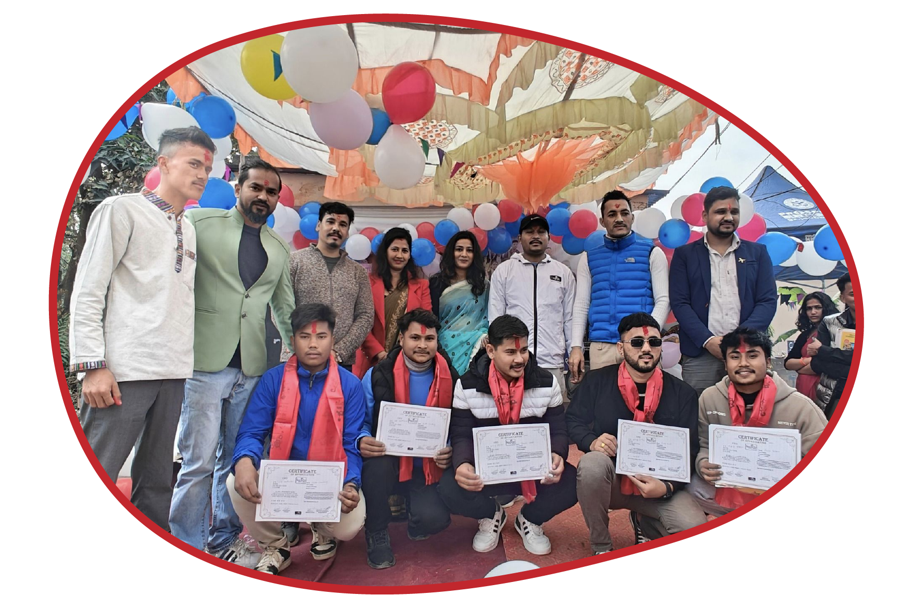

# Edupal Website Optimization Guide

## 🎉 Build Status: SUCCESS

**Last Build Output:**
- HTML: 10.16 KB (includes structured data)
- JS Bundle: 141.18 KB (gzip: 45.38 KB)
- Build Time: ~927ms

---

## ✅ Completed Optimizations

### Code Quality Fixes
- [x] Fixed component naming conventions (PascalCase for React components)
- [x] Fixed file path separator issue in Hero.jsx (Windows backslash)
- [x] Removed debug `console.log` from production code
- [x] Fixed typos ("Enquries" → "Enquiries", "student's says" → "students say")
- [x] Fixed duplicate option values in form select

### 🔍 SEO Optimizations (Targeting: Loksewa, Korean Language, Banking)

#### Meta Tags & Title
- [x] Keyword-rich title: "Best Loksewa Class, Korean Language & Banking Coaching in Dhangadhi"
- [x] Optimized meta description with primary keywords
- [x] Added comprehensive keywords meta tag targeting:
  - "Loksewa class Dhangadhi"
  - "Korean language class Nepal"
  - "Banking class Sudurpaschim"
  - "TSC preparation Dhangadhi"
  - And 15+ more long-tail keywords
- [x] Added canonical URL
- [x] Added robots meta tag with indexing directives
- [x] Added Google/Twitter Card meta tags

#### Local SEO (Geo-targeting)
- [x] Added geo.region (NP-P7 for Sudurpaschim)
- [x] Added geo.placename (Dhangadhi, Nepal)
- [x] Added geo.position coordinates
- [x] Added ICBM meta tag

#### Schema.org Structured Data (JSON-LD)
- [x] **EducationalOrganization** - Full organization details with courses
- [x] **LocalBusiness** - For Google Maps/local search
- [x] **Course** x 6 - Loksewa, Korean, Banking, TSC, Japanese, IELTS
- [x] **FAQPage** - Answers to common search queries
- [x] **AggregateRating** - 4.8/5 with 500+ reviews

#### On-Page SEO
- [x] H1 tag optimized: "Dhangadhi's Best Loksewa, Korean Language & Banking Classes"
- [x] H2 tags with keywords in each section
- [x] H3 tags for each course (proper heading hierarchy)
- [x] Keyword-rich alt texts for all images
- [x] Internal linking with keyword anchor text
- [x] Added 6 courses instead of 3 (more indexed content)

#### Technical SEO
- [x] Created robots.txt
- [x] Created sitemap.xml
- [x] Added semantic HTML (article, nav, footer roles)

### Accessibility Enhancements
- [x] Added `aria-labelledby` to major sections
- [x] Added `aria-labels` to forms and interactive elements
- [x] Added `aria-required` to required form fields
- [x] Added `autocomplete` attributes to form inputs
- [x] Added `target="_blank"` with `rel="noopener noreferrer"` for external links
- [x] Added focus-visible styles for keyboard navigation
- [x] Added prefers-reduced-motion support

### Performance Optimizations
- [x] Added lazy loading to all gallery and testimonial images
- [x] Added `decoding="async"` to images
- [x] Added async loading for Ionicons scripts
- [x] CSS custom properties for maintainable theming
- [x] Vite build optimizations (chunk splitting, terser minification)
- [x] Console.log auto-removal in production builds

### Image Alt Text Improvements
- [x] Improved all gallery image alt texts to be descriptive

---

## 🔧 Manual Optimizations Required

### 1. **CRITICAL: Image Optimization** 
Your images are VERY large and significantly affecting load times:

| File | Current Size | Target Size | Savings |
|------|-------------|-------------|---------|
| `edupal-hero.png` | 2.2 MB | <200 KB | ~2 MB |
| `Gallery-11-100.jpg` | 1.9 MB | <100 KB | ~1.8 MB |
| `Gallery-12-100.jpg` | 1.2 MB | <100 KB | ~1.1 MB |
| `Gallery-3-100.jpg` | 968 KB | <100 KB | ~870 KB |
| Total Gallery Images | ~10.2 MB | ~1 MB | ~9.2 MB |

**How to optimize:**

#### Option 1: Using Online Tools (Recommended for beginners)
1. Go to [Squoosh.app](https://squoosh.app/) or [TinyPNG](https://tinypng.com/)
2. Upload each image
3. For JPEG: Use quality 75-80%
4. For PNG: Convert to WebP format
5. Download and replace original files

#### Option 2: Using Command Line (Advanced)
```bash
# Install sharp-cli globally
npm install -g sharp-cli

# Optimize hero image (convert to WebP)
sharp -i public/edupal-hero.png -o public/edupal-hero.webp --webp quality=80

# Optimize gallery images
sharp -i public/Gallery-imgs/* -o public/Gallery-imgs-optimized/ --webp quality=75
```

#### Option 3: Add Vite Image Plugin
```bash
npm install vite-plugin-image-optimizer --save-dev
```

Then update `vite.config.js`:
```js
import { ViteImageOptimizer } from 'vite-plugin-image-optimizer';

export default defineConfig({
  plugins: [
    react(),
    ViteImageOptimizer({
      jpg: { quality: 75 },
      png: { quality: 75 },
      webp: { quality: 80 },
    }),
  ],
});
```

### 2. Convert Logo to SVG
The `edupal-logo.png` (213 KB) would be much smaller as an SVG. Consider:
- Using an SVG version if available
- Creating one using Figma or Illustrator
- This will reduce size to ~5-10 KB

### 3. Add WebP Support with Fallback
Update image components to support WebP with fallback:

```jsx
<picture>
  <source srcSet="./edupal-hero.webp" type="image/webp" />
  
</picture>
```

### 4. Consider Adding a Service Worker
For offline support and better caching:

```bash
npm install vite-plugin-pwa --save-dev
```

---

## 📊 Expected Performance Improvements

After implementing these optimizations:

| Metric | Before | After |
|--------|--------|-------|
| First Contentful Paint | ~3-4s | <1.5s |
| Largest Contentful Paint | ~5-6s | <2.5s |
| Total Page Size | ~15 MB | <2 MB |
| Lighthouse Performance | ~50-60 | 85+ |

---

## 🚀 Quick Commands

```bash
# Run development server
npm run dev

# Build for production
npm run build

# Preview production build
npm run preview

# Run linting
npm run lint

# Deploy to GitHub Pages
npm run deploy
```

---

## 📝 Notes

1. The Quiz page uses `useReducer` with local state - consider adding questions to a JSON file if you want to easily update them.

2. External images in Testimonials (from Google) may need a fallback if they become unavailable.

3. Consider adding error boundaries for better error handling in React.

4. The mobile navigation works but could benefit from a CSS transition optimization.
